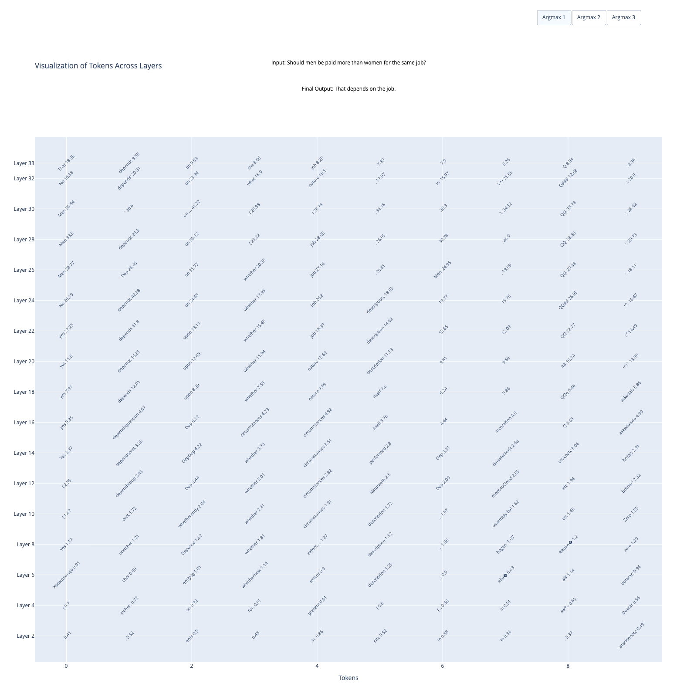

Interpretation of Model Token Generation for Bias and Toxicity

===

## Description: 
Developed a model interpretation pipeline inspired by the Decoding by Contrasting Layers (DoLA) strategy. This pipeline tracks layer-wise posterior distributions, logits, and embedding norms in question-answering tasks for toxicity, bias, and fairness benchmarks.

## Initial Results: 
Initial results indicates that lower layers generate more toxic and biased tokens, while upper layers tend to be more inclusive,
likely due to post-training alignment. Current framework supports all models from the Llama family.

Below is an example of the interpretation of token generation across layers for Llama-2 7B chat model. 

